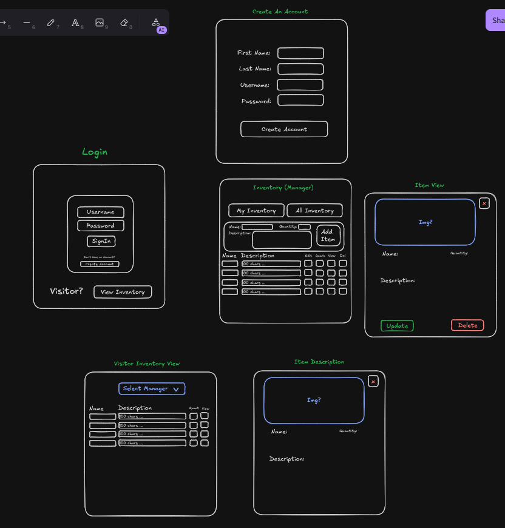
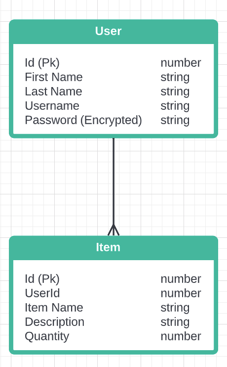

# Store Front Project

Simple overview of use/purpose.

## Description

### This project is an item inventory management system.

### Register/login.

    - Upon logging in, the user will be brought to an empty table where they can then input an item name, quantity and description.

### Add Item:

    - When user clicks submit, that data will show in the table below.

### Edit Item:

    - User can then edit that data by clicking the edit pencil.
    - Once the pencil is clicked it will open the fields for that row to be edited.
    - User can then either accept those changes or discard them.

### Delete Item:

    - By clicking the delet button on the right, users can delete the current row.

### View Item:

- Users can click the view button to see more info about that item.
- Users can also view all items by different owners by clicking the view all button on the bottom left.
- ** When the user goes back after viewing all item history, their table will be empty. However they can still review their items by searching for their Last Name in the all Items table. **

### Visitors:

- Have access to view a table of all items as well as select individual ones.
- Also have the ability to search through items.

## Planning

-Trello Link (https://trello.com/invite/b/669044cdd98a234aaea42953/ATTI9b0529eb077950b7fe5e188b95d39eeeE4BCBA39/inventory-management-project)

## Getting Started

- Open docker-desktop in the background

- In the VS Code terminal: - CD into the client folder and run 'npm install' - CD into the server folder and run 'npm install'

- After running npm install for each endpoint, in the terminal CD back to store_front and do the following: `docker-compose up --build`

- To close down the application in VS Code terminal: `docker-compose down`

## Authors

Jacob Holdgate
